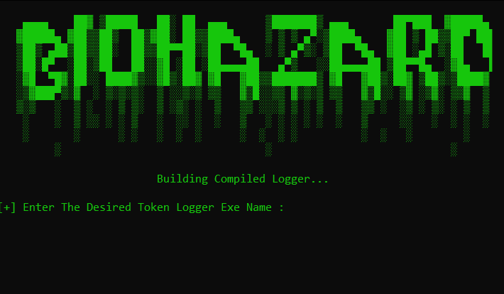
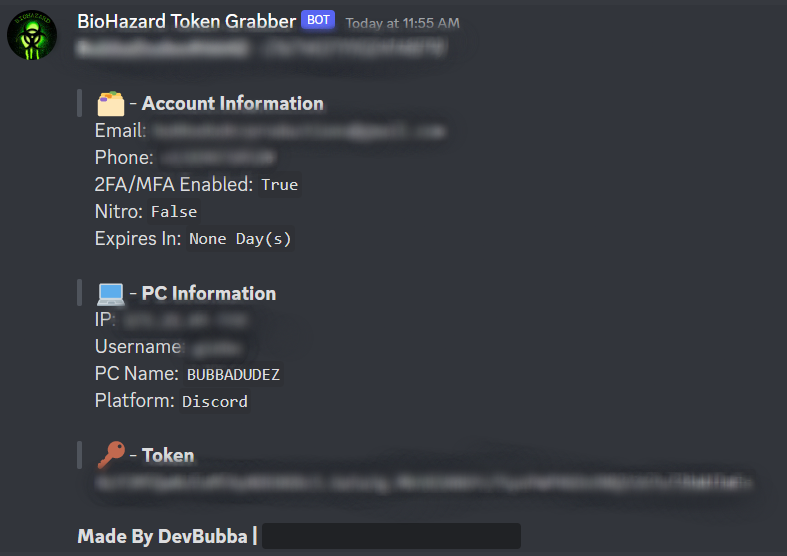

    
    
     
     
    
     
    
    
     

#  🔒 〢 Batch Obfuscator

### Super Simple And Easy Yet Advanced Discord Token Grabber Made In Python With Compiler!

## 🌐 〢 Table Of Contents

- **[📖 〢 Description](#description)**
- **[🔰 〢 Features](#features)**
- **[🔗 〢 Discord](https://discord.gg/6qAvAephsW)**
- **[📥 〢 Install](#install)**
  - **[💻 〢 Prerequisites](#prerequisites)**
  - **[⚙ 〢 Setup](#setup)**
- **[📷 〢 Preview](#preview)**
- **[📚 〢 Changelog](#changelog)**
- **[⚠️ 〢 Bugs Or Errors](#bugsorerrors)**
- **[🧾 〢 Lisence](#lisence)**

##  🔰 〢 Features

- `Logs Token, Pc Info, And Account Info`🟢
- `Compiler (.exe)`🟢
- `Compiled Logger Works On All Versions Of Windows`🟢
- `Make An Embebed Version`🟡
- `Auto Update`🟡
- `Safe Mode For Testing Purposes`🟡
- `Discord Injection`🔴
- `Compiled Logger Works On MacBook`🔴

🟢 = Working  | 🟡 = To Do  | 🔴 = Not Working

##  📥 〢 Install

###  💻 〢 Prerequisites

-   Windows 7/10/11
-   **[Python](https://www.python.org)**

###  ⚙️ Setup

1. Download The Source Code **[Here]()** Or Your Prefered Version
2. Extract Source Code
3. Make Sure Python Is Installed If Not Install It **[Here](https://www.python.org/downloads/release/python-3112/)**
4. Run `Install.bat` To Install The Required Requirements For The BioHazard Token Grabber To Function Properly
5. If The Installer Doesnt Workproperly Or Doesnt Install The Requirements Needed For The Batch Obfuscator A Fix To This Can Be Executing This Command `pip install -r requirements.txt` Which Can Be An Alternate Way To Install The Requirements Properly
6. Edit main.py And Put Your Discord Webhook In Where It Says `__YOUR WEBHOOK HERE__` And Make Sure The Save The Changes
7. You Can Do A Test Run To Make Sure The Logger Is Working Properly And If It Is You Will Recive A Message In The Channel The Webhook Is Set To Of The Logged Token Info
8. You Can Compile (.exe) The Logger By Opening `Compile.bat`
9. Have Fun Logging Kids On Discord!

##  📷 〢 Preview

    
    
    </img>
    
 

##  📚 〢 Changelog 

All Notable Changes To BioHazard-Token-Grabber (This Project) Will Be Documented In This [File](https://github.com/DevBubba/BioHazard-Token-Grabber
/blob/main/CHANGELOG.md)

##  ⚠️ Bugs Or Errors?

-   To Report An Error Make An **[Issue](https://github.com/DevBubba/BioHazard-Token-Grabber/issues)**
-   Or Join The **[Discord](https://discord.gg/6qAvAephsW)**

## 🧾  License

### This is for educational purposes only, use at your own risk, I am not responsible for any of your actions!
### BioHazard-Token-Grabber is licensed under the <a href="https://mit-license.org/.">MIT License</a>

